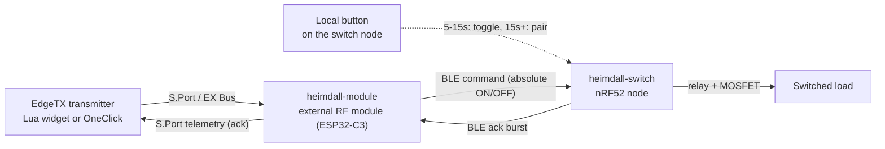

# heimdall-switch

Wireless power switch node for RC vehicles, part of the [Heimdall Suite](../heimdall-kickoff.md).

Controlled from `heimdall-module` over BLE, independent of the vehicle's
normal RC control link (e.g. CRSF) — this switch has its own out-of-band
radio path so it keeps working regardless of the state of the main control
link. It originated as a replacement for a boat's Jeti SPS-20 magnetic
switch, but is built as a generic building block (not a single-purpose
commercial part like Jeti's RCPS10) so the same design serves any RC
vehicle — boat, plane, car — needing a remotely switched load.

## How it's triggered

The transmitter side (Lua widget or a OneClick action) sends the command
through `heimdall-module`, the external RF module in the transmitter's
module bay; `heimdall-module` relays it over BLE to `heimdall-switch`,
which drives the relay/MOSFET and acks back the same path so the widget can
show "Hello" / "Goodbye" / "No response". The node also has a local button
for manual toggling and pairing, independent of that whole chain.

## Docs

- [.docs/hardware.md](.docs/hardware.md) — MCU, power, switching stage,
  feedback, button/LED, open hardware items
- [.docs/protocol.md](.docs/protocol.md) — BLE roles, pairing, runtime
  cycle, command/ack frame layouts, the transmitter-side Lua widget
- [.agents/AGENTS.md](.agents/AGENTS.md) / [CLAUDE.md](CLAUDE.md) —
  instructions for AI coding agents working in this repo

## Status

No firmware yet. nRF52 toolchain (nRF5 SDK vs. nRF Connect SDK/Zephyr vs.
upstream Zephyr) is not yet decided. `src/` is a placeholder until that's
settled.
